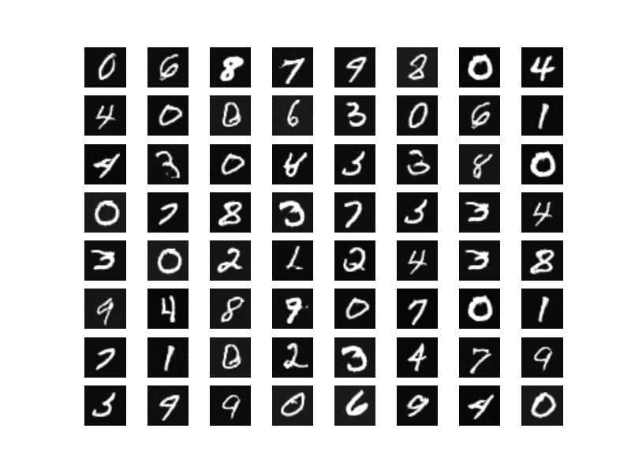

# Tensorflow implementation of WGAN

Very nice idea from Facebook. Instead of using the loss of original GAN:```E[-(log D(x) + log D(G(z))]```, which will raise vanishing gradient problem
when training the discriminator to optimility, they use a fix of the discriminator loss```E[D(G(z))] - E[D(x)]```. 


Finished evaluating on MNIST dataset. Trained the WGAN for 100 iterations.
Below picture are the generated digits from WGAN


